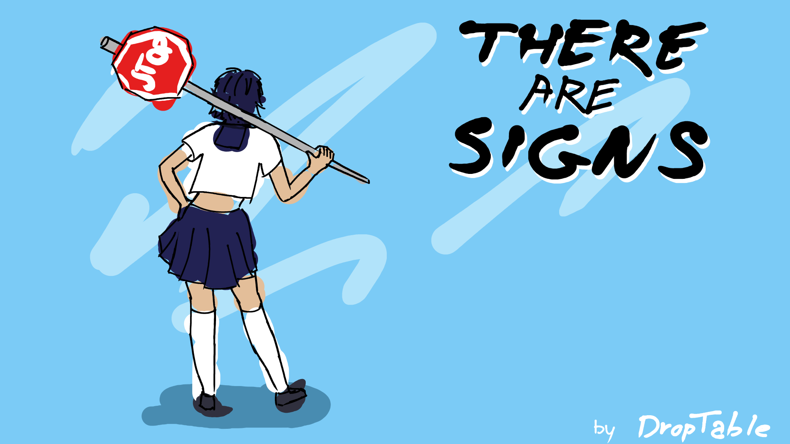

<h1 align="center"><b>There are Signs</b></h3>

  

## What is it?
There are Signs is a game developed on Unity Engine for Komiks Game Jam 2k25 competition. Theme of this competition was: "There's no accidents, only signs".

## Overview
There are Signs is a logic platformer game. You can use signs to manipulate environment and movement. Use your kicks to defeat your enemies. Game take place in Japanese streets and school. Best your enemies and elites in your school to become popular. 

## How to play?
Go to: https://muppetsg2.itch.io/there-are-signs

## How do I build and run this?
This is a Unity 6000.0.24f1 project, so all you need to do is open the repository’s root folder in Unity.

## Credits
| Name | Link | Role |
|------|--------|--------|
| Marceli Antosik | https://github.com/Muppetsg2 | UI Programming |
| Patryk Antosik | https://github.com/MAIPA01 | AI Programming & Level Design |
| Bartłomiej Włodarski | https://github.com/BartlomiejWlodarski | Programming & Game Design |
| Maja Ochmańska | https://github.com/Maikomi | Art Lead & Game Design |
